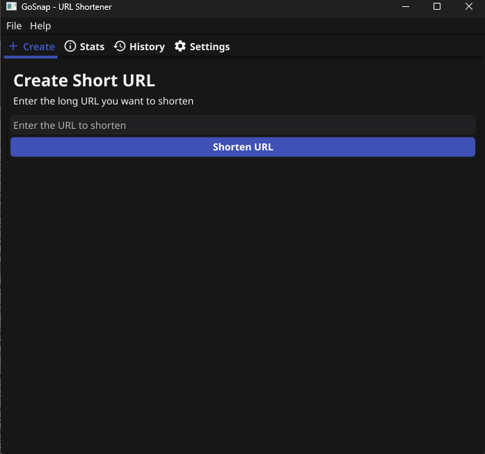
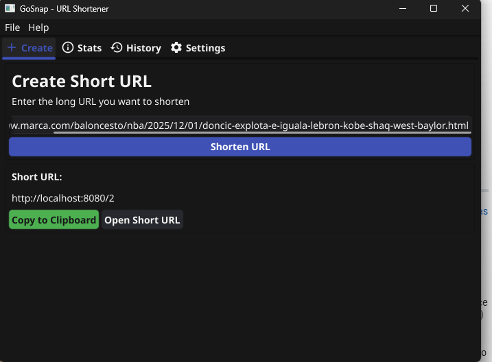
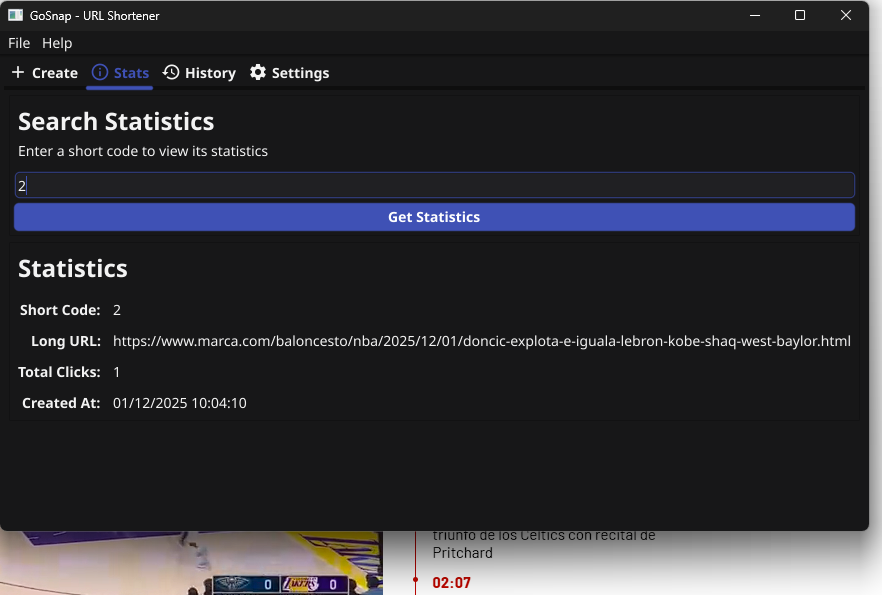
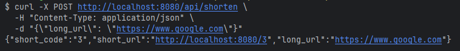

<div align="center">
  
</div>

# GoSnap

A high-performance URL shortener built with Go, featuring both a REST API server and a desktop client with a modern GUI.


## About the Project

This project was born out of a desire to master **Go** and **Clean Architecture** patterns in a real-world scenario. I wanted to build something more complex than a simple CRUD API—a system that handles high-concurrency (URL redirection), state management (Desktop GUI), and infrastructure orchestration (Docker).

**Key Learning Outcomes:**
- Implementing **Clean Architecture** to decouple business logic from external frameworks.
- Managing high-performance data access with **Redis** caching strategies.
- Building cross-platform desktop interfaces using **Fyne**.
- Containerizing a full-stack application with **Docker Compose**.

## Features

- **Fast URL Shortening**: Generate short, unique URLs using base62 encoding
- **Dual Interface**: REST API server and cross-platform desktop application
- **Redis Caching**: Lightning-fast URL lookups with Redis cache
- **PostgreSQL Storage**: Reliable, persistent storage for URLs and statistics
- **Click Tracking**: Monitor URL usage with detailed analytics
- **Modern UI**: Clean desktop interface built with Fyne
- **Docker Support**: Easy deployment with Docker Compose
- **Graceful Shutdown**: Proper cleanup and connection handling
- **Structured Logging**: Comprehensive logging with zerolog

## Architecture

GoSnap follows a clean architecture pattern with clear separation of concerns:

```
├── cmd/
│   ├── server/       # REST API server
│   └── desktop/      # Desktop GUI application
├── internal/
│   ├── api/          # HTTP handlers and routes
│   ├── domain/       # Domain models
│   ├── repo/         # Repository layer (PostgreSQL, Redis)
│   ├── service/      # Business logic
│   ├── shortid/      # Short code generation
│   └── ui/           # Desktop UI components
├── pkg/
│   └── validator/    # URL and short code validation
└── resources/        # Database initialization scripts
```

### Design Decisions

- **Redis for Caching**: Chosen to ensure sub-millisecond response times for frequently accessed URLs, reducing load on PostgreSQL.
- **Hexagonal Architecture**: The `internal` directory structure ensures that the core domain logic remains independent of the database or HTTP framework, making the code testable and maintainable.
- **Fyne for Desktop**: Selected for its ability to compile to native binaries for Windows, macOS, and Linux from a single Go codebase.


## Screenshots

### Desktop Application



*Create short URLs with the desktop client*



*Short URL created successfully*



*Track URL clicks and analytics*

### API Response Example



*REST API JSON response*


## Prerequisites

- **Go**: 1.24.3 or higher
- **Docker & Docker Compose**: For running PostgreSQL and Redis
- **PostgreSQL**: 15+ (managed via Docker)
- **Redis**: 7+ (managed via Docker)

## Installation

### 1. Clone the Repository

```bash
git clone https://github.com/Elisandil/go-snap.git
cd go-snap
```

### 2. Set Up Environment Variables

Copy the template and configure your environment:

```bash
cp .env.template .env
mkdir bin
```

Edit `.env` with your preferred settings. Default configuration works out of the box.

### 3. Start Infrastructure

Launch PostgreSQL and Redis with Docker Compose:

```bash
docker-compose up -d postgres redis
```

This will:
- Start PostgreSQL on port 5432
- Start Redis on port 6379
- Initialize the database schema automatically
- Create persistent volumes for data

### 4. Build the Applications

#### Server (API)

```bash
go build -o bin/server ./cmd/server
```

#### Desktop Client

```bash
go build -o bin/desktop ./cmd/desktop
```

## Usage

### Running the API Server

```bash
./bin/server
```

The server will start on `http://localhost:8080` (configurable via `SERVER_PORT`)

#### API Endpoints

**Create Short URL**
```bash
POST /api/shorten
Content-Type: application/json

{
  "long_url": "https://www.example.com/very/long/url"
}

Response:
{
  "short_code": "dBq2K9",
  "short_url": "http://gosnap.com/dBq2K9",
  "long_url": "https://www.example.com/very/long/url"
}
```

**Redirect to Long URL**
```bash
GET /:shortCode

Response: 302 Redirect to original URL
```

**Get URL Statistics**
```bash
GET /api/stats/:shortCode

Response:
{
  "short_code": "dBq2K9",
  "long_url": "https://www.example.com/very/long/url",
  "clicks": 42,
  "created_at": "2025-12-01T10:30:00Z"
}
```

### Running the Desktop Client

```bash
./bin/desktop
```

The desktop application provides:
- **Create Tab**: Generate new short URLs
- **History Tab**: View recently created URLs
- **Statistics Tab**: Analyze URL performance
- **Settings Tab**: Configure API endpoint and preferences

### Using Docker Compose (Full Stack)

Run the entire application stack:

```bash
docker-compose up -d
```

This starts:
- PostgreSQL database
- Redis cache
- API server
- All with proper health checks and dependencies

Access the API at `http://localhost:8080`

## Configuration

### Environment Variables

| Variable | Description | Default |
|----------|-------------|---------|
| `SERVER_PORT` | API server port | `8080` |
| `SERVER_BASE_URL` | Base URL for short links | `http://localhost:8080` |
| `POSTGRES_HOST` | PostgreSQL hostname | `localhost` |
| `POSTGRES_PORT` | PostgreSQL port | `5432` |
| `POSTGRES_USER` | Database user | `postgres` |
| `POSTGRES_PASSWORD` | Database password | `postgres` |
| `POSTGRES_DATABASE` | Database name | `urlshortener` |
| `POSTGRES_MAX_CONNECTIONS` | Max DB connections | `25` |
| `POSTGRES_MIN_CONNECTIONS` | Min DB connections | `5` |
| `REDIS_HOST` | Redis hostname | `localhost` |
| `REDIS_PORT` | Redis port | `6379` |
| `REDIS_PASSWORD` | Redis password | `password` |
| `REDIS_DB` | Redis database number | `0` |
| `REDIS_POOL_SIZE` | Redis connection pool size | `10` |
| `LOG_LEVEL` | Logging level (debug/info/warn/error) | `info` |
| `LOG_FORMAT` | Log format (json/console) | `json` |

## Development

### Running Tests

```bash
# Unit tests
go test ./...

# Integration tests (requires test databases)
docker-compose up -d postgres-test redis-test
go test ./internal/integration/...
```

### Key Components

**Short Code Generation**
- Base62 encoding (0-9, a-z, A-Z)
- Collision detection with retry mechanism
- Predictable length based on ID

**Caching Strategy**
- Redis cache for hot URLs
- 24-hour TTL
- Cache-aside pattern
- Async cache warming

**Click Tracking**
- Asynchronous increment to avoid blocking
- Worker pool (100 concurrent workers)
- Graceful degradation on high load

## Performance

- **Response Time**: < 10ms for cached URLs
- **Throughput**: 10,000+ requests/second
- **Concurrency**: Built-in connection pooling
- **Scalability**: Horizontal scaling ready

## Roadmap

- [ ] **User Accounts**: Authentication and personalized dashboard.
- [ ] **Custom Aliases**: Allow users to define their own short codes (e.g., `gosnap.com/my-link`).
- [ ] **QR Code Generation**: Auto-generate QR codes for shortened URLs.
- [ ] **Advanced Analytics**: Geolocation and device type tracking.

## Author

**aog-dev**
- GitHub: [@Elisandil](https://github.com/Elisandil)

## Acknowledgments

- Built with [Echo](https://echo.labstack.com/) web framework
- UI powered by [Fyne](https://fyne.io/)
- Logging with [zerolog](https://github.com/rs/zerolog)
- Database access via [pgx](https://github.com/jackc/pgx)
- Redis client: [go-redis](https://github.com/redis/go-redis)

## 🤝 Contributing

Contributions are welcome! This is a personal project for learning, but I'm open to feedback and improvements.

1. Fork the Project
2. Create your Feature Branch (`git checkout -b feature/AmazingFeature`)
3. Commit your Changes (`git commit -m 'Add some AmazingFeature'`)
4. Push to the Branch (`git push origin feature/AmazingFeature`)
5. Open a Pull Request
